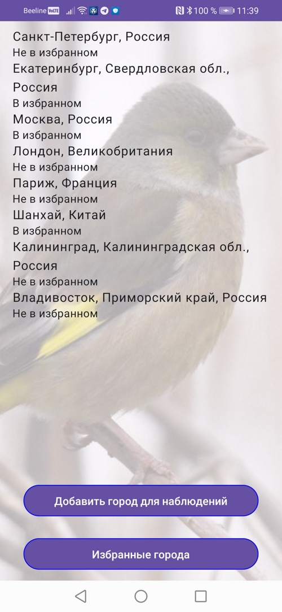
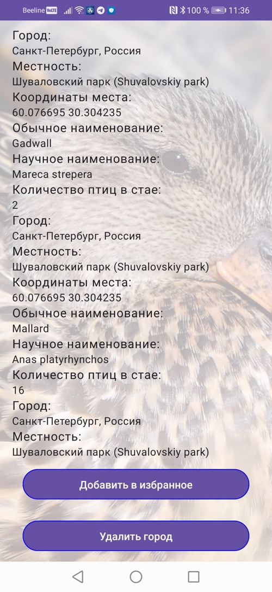
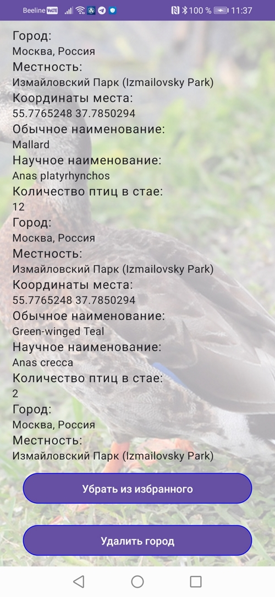
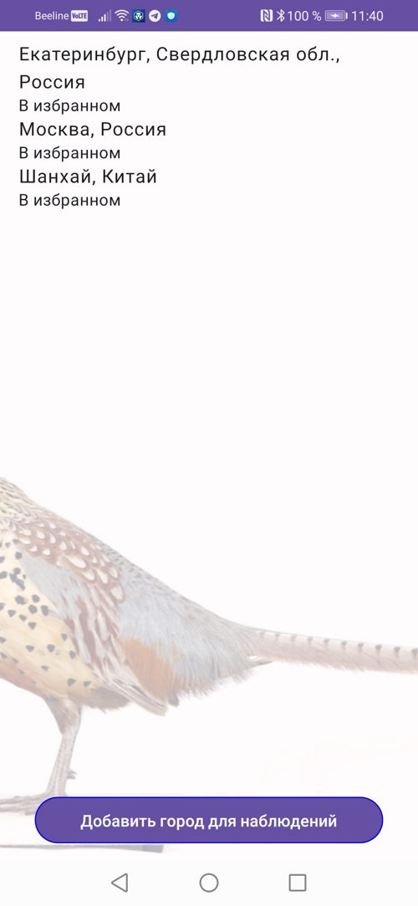
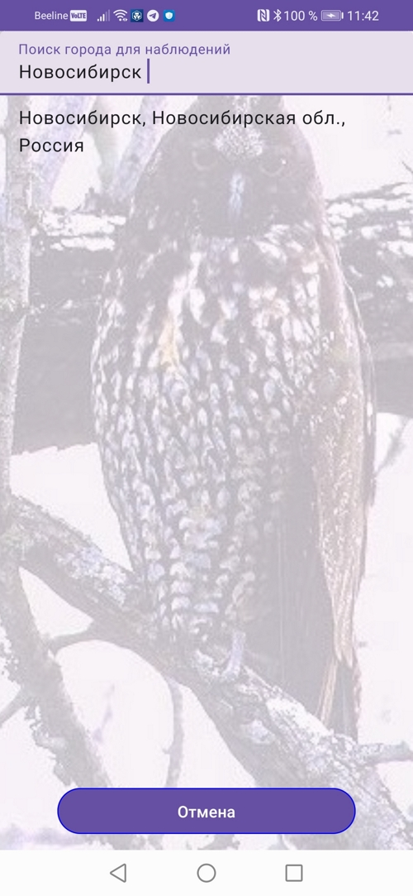

# UsetechTestTask
Тестовое задание Android для Usetech. Использует данные орнитологического сервиса eBird для отображения информации о наблюдениях за птицами из добавляемых в список городов

#### Архитектура приложения
1. Используется архитектура MVVM, приложение полностью написано на Jetpack Compose (без использования классических XML Layouts) и использует Material Design. Используются корутины Kotlin Flow и Android Room для персистентности данных
2. Используются Hilt, Retrofit2, RxJava
3. Бонусом добавлено полноэкранное фоновое загружаемое фото птиц из наблюдаемых стай из добавляемых городов в списке из Google Images

#### Инструкции
1. В файле res/raw/config.json находится начальная конфигурация приложения содержащая ключ API для сервиса eBird и ключи API для сервиса поиска изображений Google Images
2. Для удаления города из списка или изменения его статуса избранного нужно перейти на его страницу наблюдений за птицами и нажать соответствующие кнопки внизу экрана

#### Внимание
Фоновые изображения птиц подгружаются через Google Images с квотой 100 запросов в сутки, поэтому от интенсивного использования приложения фоновое изображение может переставать загружаться до следующего дня

#### Скриншоты

